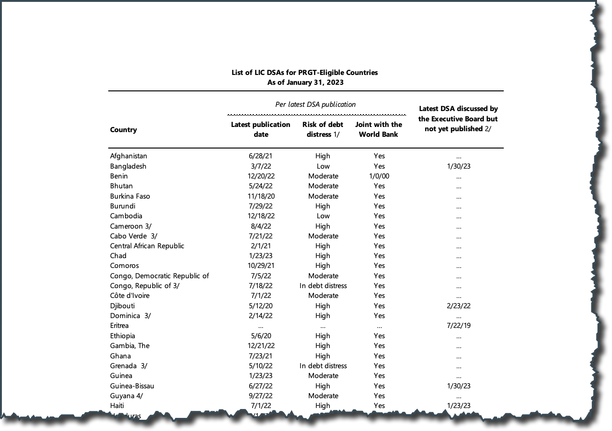

IMF Debt Distress List
================
Teal Emery

## Introduction

The IMF publishes the risk of debt distress for
[PRGT](https://www.imf.org/en/About/Factsheets/IMF-Support-for-Low-Income-Countries)
Eligible Countries that use the [LIC
DSA](https://www.imf.org/en/Publications/DSA).

While this data is public, it’s [published online in a
pdf](https://www.imf.org/external/pubs/ft/dsa/dsalist.pdf), which makes
it burdensome for researchers & policymakers to use & update. I’m
scraping the data using R, and publishing it on GitHub as a `.csv` file
for all to use. I need this for my own research, but I’m hoping it will
be useful to others.

Example of the IMF LIC DSA List

# Features

**Annotated Script**: want to run this or modify this script yourself?
The script is annotated, so it should be straightforward.

**Standardized Country Naming**: I’ve standardized the names using the
[`countrycode` R
Package](https://github.com/vincentarelbundock/countrycode), and added
[iso3c codes](https://en.wikipedia.org/wiki/ISO_3166-1_alpha-3) to make
it easy to connect this data to other sovereign-level data.

**File Naming Convention**: The script extracts the as of date listed at
the top of the pdf, and appends it to the end of the file name so that
it is clear when the data is from.

Eventually I’d like to automate this to run periodically using GitHub
Actions. If you want to help with this, ping me.
