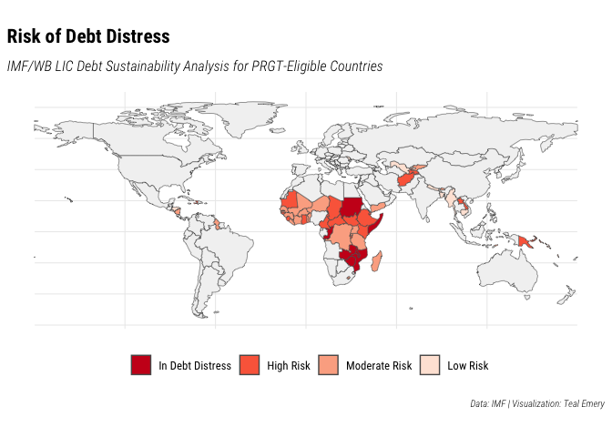

Debt Distress map
================
Teal Emery

``` r
library(tidyverse)
library(rnaturalearth)
library(here)
```

``` r
dsa_list_url <- "https://raw.githubusercontent.com/t-emery/imf_dsa_list/master/data/imf_lic_dsa_list_as_of_2023-01-31.csv"

dsa_list_tbl <- dsa_list_url |> 
  read_csv()
```

    Rows: 70 Columns: 8
    ── Column specification ────────────────────────────────────────────────────────
    Delimiter: ","
    chr  (5): country_name, iso3c, risk_of_distress, joint_w_wb, country_notes
    date (3): date_latest_pub, date_latest_exec_board_not_published, dsa_list_date

    ℹ Use `spec()` to retrieve the full column specification for this data.
    ℹ Specify the column types or set `show_col_types = FALSE` to quiet this message.

``` r
dsa_list_tbl
```

    # A tibble: 70 × 8
       country_name   iso3c date_lat…¹ risk_…² joint…³ date_lat…⁴ count…⁵ dsa_list…⁶
       <chr>          <chr> <date>     <chr>   <chr>   <date>     <chr>   <date>    
     1 Afghanistan    AFG   2021-06-28 High    Yes     NA         <NA>    2023-01-31
     2 Bangladesh     BGD   2022-03-07 Low     Yes     2023-01-30 <NA>    2023-01-31
     3 Benin          BEN   2022-12-20 Modera… <NA>    NA         <NA>    2023-01-31
     4 Bhutan         BTN   2022-05-24 Modera… Yes     NA         <NA>    2023-01-31
     5 Burkina Faso   BFA   2020-11-18 Modera… Yes     NA         <NA>    2023-01-31
     6 Burundi        BDI   2022-07-29 High    Yes     NA         <NA>    2023-01-31
     7 Cambodia       KHM   2022-12-18 Low     Yes     NA         <NA>    2023-01-31
     8 Cameroon       CMR   2022-08-04 High    Yes     NA         3/      2023-01-31
     9 Cape Verde     CPV   2022-07-21 Modera… Yes     NA         3/      2023-01-31
    10 Central Afric… CAF   2021-02-01 High    Yes     NA         <NA>    2023-01-31
    # … with 60 more rows, and abbreviated variable names ¹​date_latest_pub,
    #   ²​risk_of_distress, ³​joint_w_wb, ⁴​date_latest_exec_board_not_published,
    #   ⁵​country_notes, ⁶​dsa_list_date

``` r
dsa_list_tbl |> 
  distinct(risk_of_distress)
```

    # A tibble: 5 × 1
      risk_of_distress
      <chr>           
    1 High            
    2 Low             
    3 Moderate        
    4 In debt distress
    5 <NA>            

``` r
ne_map_data <- ne_countries(returnclass = "sf")
```

``` r
debt_distress_names <- tribble(~risk_of_distress, ~chart_name,
        "In debt distress", "In Debt Distress",
        "High", "High Risk",
        "Moderate", "Moderate Risk",
        "Low", "Low Risk") |> 
  mutate(chart_name = factor(chart_name, levels = c("In Debt Distress", "High Risk", "Moderate Risk", "Low Risk")))

debt_distress_names
```

    # A tibble: 4 × 2
      risk_of_distress chart_name      
      <chr>            <fct>           
    1 In debt distress In Debt Distress
    2 High             High Risk       
    3 Moderate         Moderate Risk   
    4 Low              Low Risk        

``` r
debt_colors <- c("In Debt Distress" = "#cb181d", "High Risk" = "#fb6a4a", "Moderate Risk" = "#fcae91", "Low Risk" = "#fee5d9")
```

``` r
viridis_option = "G"
base_family = "Roboto Condensed"
base_size = 12
title_size = 16
subtitle_size = 12
caption_size = 8

g <- ne_map_data |> 
  left_join(dsa_list_tbl, by = c("iso_a3" = "iso3c")) |> 
  left_join(debt_distress_names, by = join_by(risk_of_distress)) |> 
  filter(iso_a3 != "ATA") |>  # remove Antarctica
  ggplot(aes(fill = chart_name)) +
  geom_sf() +
  #scale_fill_viridis_d(option = "G", na.value = "grey95", direction = -1) +
  scale_fill_manual(values = debt_colors, na.value = "grey95") +
  theme_minimal(base_size = base_size, base_family = base_family) +
  theme(legend.position="bottom",
        axis.text.x=element_blank(),
        axis.ticks.x=element_blank(),

        text = element_text(family = base_family, size = base_size),
        plot.title = element_text(family = paste(base_family,"Bold"), 
                                  size = title_size, hjust=0),
        plot.subtitle = element_text(family = paste(base_family,"Light Italic"), 
                                     size = subtitle_size, hjust=0, 
                                     margin = margin(0.2, 0, 0.5, 0, unit="cm")),
        plot.caption = element_text(family = paste(base_family,"Light Italic"), 
                                    size = caption_size, 
                                    margin = margin(0.5, 0, 0, 0, unit = "cm"), 
                                    hjust = 1),
        ) +
    labs(
      title = str_wrap("Risk of Debt Distress",width = 60),
      subtitle = str_wrap("IMF/WB LIC Debt Sustainability Analysis for PRGT-Eligible Countries"),
      fill = NULL,
      caption = str_wrap("Data: IMF | Visualization: Teal Emery",width = 70)
  )

g
```



``` r
ggsave(here("images", "debt_distress_map.jpeg"), device = "jpeg", width = 7, height = 5)
```
